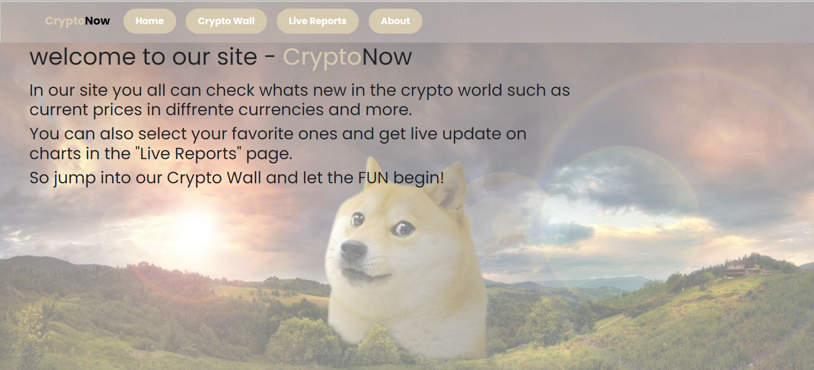
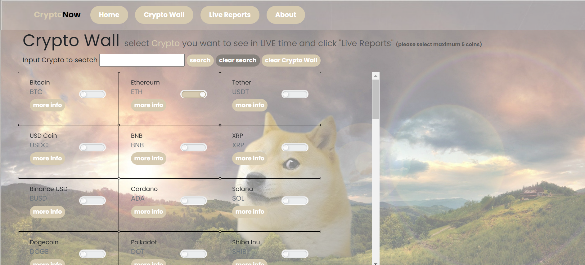
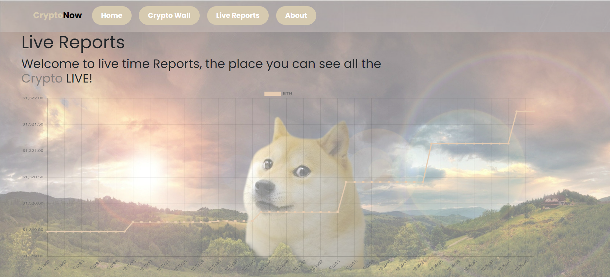
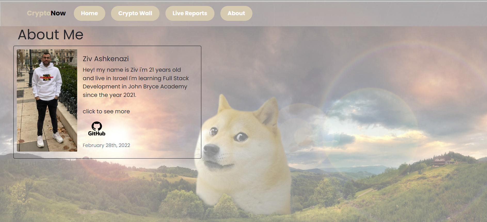

# Project Title

Crypto Now!

## Description

On my site, you can view your favorite crypto tokens and watch their movement LIVE !  
In the Crypto wall page you can choose up to 5 tokens, then move to "Live Reports"  
  
Technologies I used in my project: JavaScript, Rest API, CSS.

## Images

   

## Getting Started

### Installing

git clone my reposetory to your local folder.

### Executing program

* Open the index.html file and run it locally on your computer.

## Authors

Ziv Ashkenazi 
[@Linkdin](https://www.linkedin.com/in/ziv-ashkenazi/)
